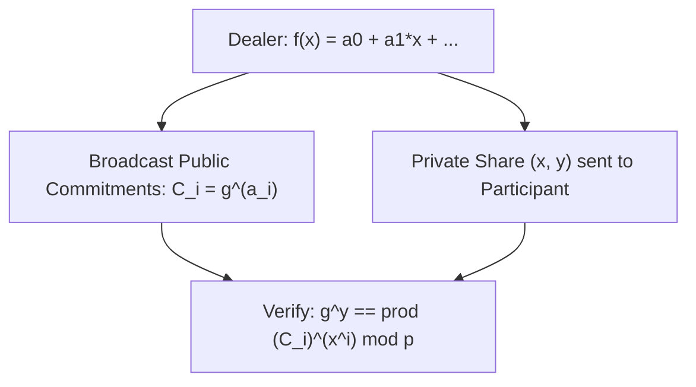

# Feldman's Verifiable Secret Sharing (VSS) Skill

Robust, zero-dependency Python implementation of **Feldman's Verifiable Secret Sharing (VSS)** for verifiable distributed key generation.

## Features
- **Public Commitment Verification**: Participants verify their received polynomial shares without revealing private values.
- **Malicious Dealer Detection**: Prevents corrupt dealers from distributing inconsistent shares.
- **Zero External Dependencies**: Pure Python standard library.
- **Native MCP Protocol**: JSON-RPC 2.0 stdio server compatible with Claude Desktop, Cursor, and Windsurf.

## Architecture

